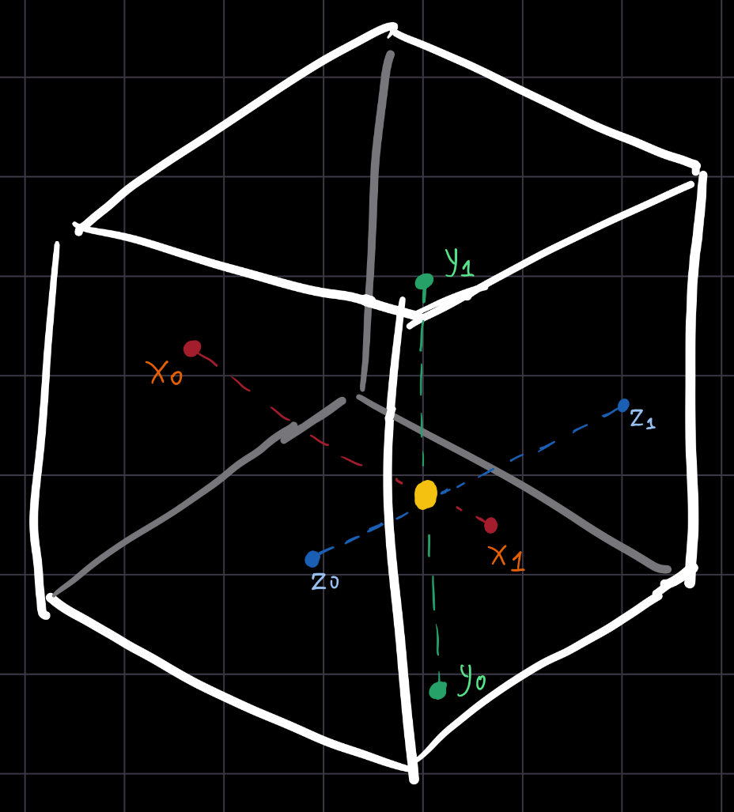
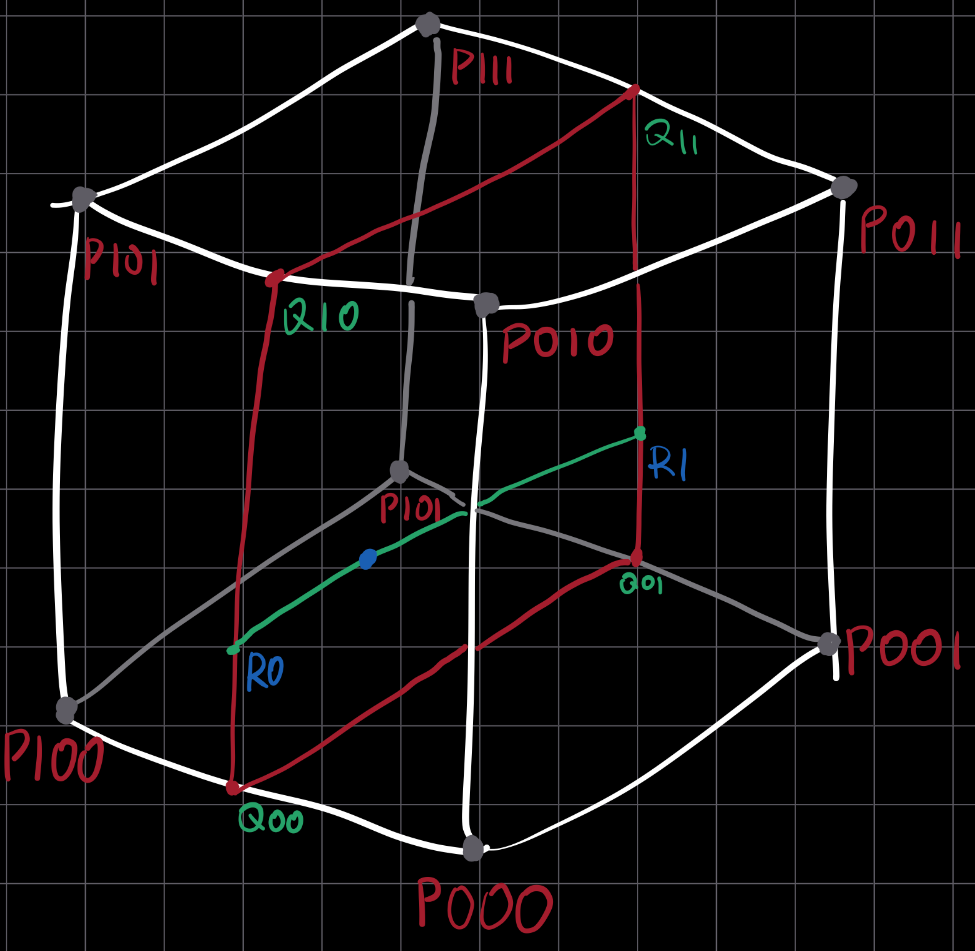
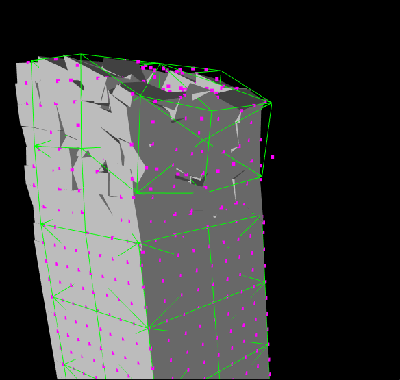

+++
date = "2026-09-18"
title = "Razed's Continuous Real-time Deformation System"
description = "Documenting the development of Razed's deformation system."
authors = ["anisotropic"]
[taxonomies]
tags = ["something"]
[extra]
page_id = "razed_cage1"
math = true
+++

Structures in Razed are arbitrarily shaped, they are expected to shatter, break, bend, and sway in any direction and intensity. The "structural" physics is approximated by a sparse lattice structure formed by nodes evaluated through an XPBD (eXtended Position-Based Dynamics) solver, where each node has some mass, integrity, and resistance values based on the integrity of the nearby structure "fragments" surrounding it and a coarse approximation of the intended structural material (e.g., a node located in a part of the structure that is intended to be in a weaker material, such as wood, would have a lower resistance and mass in comparison to a harder material like concrete).

In short, the sparse lattice provides a very cheap and sufficiently accurate approximation of the structural physics at the core of a structure, but that is only one part of the simulation: as the structures deforms, its "fragments" must deform in response.

Razed's deformation system was something I iterated on multiple times, and I'll describe each iteration below.

## 1. Trivial LBS-like deformation

The first iteration of the deformation system was essentially an application of Linear-Blend-Skinning between an individual fragment and `N` nearby lattice nodes.

Each fragment was associated to `N` nodes, and for each vertex of the fragment's mesh a quadratic IDW (Inverse Distance Weight) was computed as:

$$ w_i = \frac{1}{(p - p^n_i) \cdot (p - p^n_i)}\\ $$
$$ \text{\small where $p$ is the position of the vertex, and $p^n_i$ is the position of the $i$ node at initialisation} $$

(Note the use of the dot product to produce a squared length)

This would be used during deformation to weight that node's positional offset (in respect to its position at initialisation):
$$\text{For each vertex:}$$
$$\Delta p=\sum_{i=0}^{N-1}{w_{i}(s^n_i - p^n_i)}$$
$$\text{\small where $s^n_i$ is the current position of the node}$$

This was done per-vertex, using the `N` nearest nodes associated to the fragment (found at fragment creation in a one-time spatial query). The weight was computed in that same vertex shader, which means that a bunch of bind-time data was stored at all times and frequently read by the vertex shader. The fragment is associated to its mesh merely by ID, and meshes are not unique per-fragment (in addition to their data no longer being present on the CPU by this point), so I preferred computing weights in real-time rather than pre-computing them.

This approach extremely simple although a little suboptimal in terms of efficiency. In any case, it did not properly work, as the lattice was too sparse to directly apply its positional changes to the much more dense fragments and caused severe artifacts.

## 2. Extension of iter. 1 with intermediate dense volume representation

The previous approach was extended by the introduction of an intermediate layer between the structural lattice and visual fragments.

The cage layer is essentially a dense 3-dimensional array of points that cover the entire volume of the structure. I usually call these "deform points".

At creation, the maximum AABB extents of the structure are computed and, based on the desired density of the deformation cage, the array is generated. For each deform point, the 4 nearest lattice nodes were selected and associated to it with a quadratic IDW, computed the same way as before. For each fragment, a spatial query fetches the 8 nearest deform points. These points form a cuboid around the fragment, which acts like a deformation cage for it. The LBS application of the previous iteration moved from $lattice \rightarrow fragment$ to $lattice \rightarrow cage$, which proved to be more stable than the previous approach.



While the $lattice \rightarrow cage$ deformation remains the same process described in iteration 1, the new $cage \rightarrow fragment$ deformation worked differently: for each vertex, trilinear interpolation with the fragment's associated cage is performed in the vertex shader. A series of interpolation factors, that act like the vertex's normlized cage-local coordinates, are computed for each vertex in that same vertex shader invocation from an AABB of the cage's bind-time corners (the corners of the cage at the time of its creation).

$$\text{For every vertex:}$$

$$ \mathbf{w}=\begin{pmatrix}
	\frac{s_x}{x_1 - x_0}\\
	\frac{s_y}{y_1 - y_0}\\
	\frac{s_z}{z_1 - z_0}
	\end{pmatrix}$$
<sub>where $s$ is the local vertex position and $x,y,z$ indicates the corresponding axis of the cage as an AABB, denominated as 0 for the min extent and 1 for the max extent</sub>

On the left a graphic shows how the normalized cage-local coordinates are calculated: the white box is the cage's bind-time AABB as formed by the 8 deform points associated to the fragment; the yellow dot is the local vertex position; the colored axes are local to the cage and are used to determine the interpolation weights.

Initially, the final interpolation used yet _another_ AABB using the real-time cage corners to construct it. This worked, but completely eliminated any distortion or shear. Unlike the bind-time cage corners, which are guaranteed to be an AABB anyways, once the cage deforms it can no longer be represented that way.

Instead, it was more accurate to perform the interpolation per-edge, using the $\mathbf{w}$ normalized cage-local coordinates, like in the graphic shown to the right (there the cage is assumed to not have deformed at all, purely for simplicity):



```glsl
vec3 p000 = /*-x, -y, -z corner*/
vec3 p100 = /*+x, -y, -z corner*/
vec3 p010 = /*-x, +y, -z corner*/
vec3 p110 = /*+x, +y, -z corner*/
vec3 p001 = /*-x, -y, +z corner*/
vec3 p101 = /*+x, -y, +z corner*/
vec3 p011 = /*-x, +y, +z corner*/
vec3 p111 = /*+x, +y, +z corner*/

// interpolate 3d volume to a 2d plane Q
// only variates along the Y axis
vec3 q00 = mix(p000, p100, w.x);
vec3 q10 = mix(p010, p110, w.x);
vec3 q01 = mix(p001, p101, w.x);
vec3 q11 = mix(p011, p111, w.x);

// interpolate 2d plane to edge R
// only variates along the Z axis
vec3 r0 = mix(q00, q10, w.y);
vec3 r1 = mix(q01, q11, w.y);

// interpolate final point from edge
vec3 s = mix(r0, r1, w.z);
```

<div class="flex items-center space-x-8">
	
	<div class="w-2/3">
		On the left an example of the deformation using this version of the system. The green lines highlight the constraints between the sparse lattice nodes, the magenta dots represent cage deformation points.<br/><br/>
		As it can be observed, while the deformation now gives a somewhat plausible idea, there is still something off: while the fragments themselves seem to correctly deform according to the cages, the cages dont properly deform according to the sparse lattice. This can be seen, for example, for that one single magenta dot at the right <i>outside</i> of the structure. This makes it evident that the $lattice \rightarrow cage$ LBS-like deformation is not the correct procedure.<br/><br/>
		Despite this, I kept this system for a couple of months while working on other parts of Razed and the engine, before addressing the issue again, as documented in the next sections.
	</div>
</div>

## 3. WIP
$$
